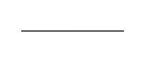
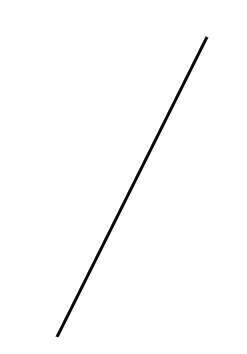

# Objectives


- Give a brief introduction to the D3 javascript library 

--

- Show how to combine D3 and R to create powerful interactive visualizations
.center[]

---

# Agenda


- What is D3?
- Building your first simple plot with D3
- What is r2d3?
- Adding animation to a plot
- Building an animated Kaplan Meier curve in D3
- Sharing your visualization in rmarkdown, shiny and as a standalone page
- Show how to combine D3 and R to create powerful interactive visualizations
- [Content on github](https://github.com/murrayjw/CRUG)

.center[]


---

# About me

- From the east coast of Canada (NB), but live in Toronto, Ontario
- Statistician by training, worked as a data scientist in healthcare since 2012. 
- Taught applied statistics and data science at U of T
- Been with Cytel since August of 2022
- Support Novartis, primarily building Shiny applications and animated visualizations

---

# Animated Visualizations in Data Storytelling

- In today's data-driven world, the ability to effectively communicate data insights is essential.
- Static charts and graphs often struggle to capture the audience's attention and convey the full story behind the data.
- Animated visualizations bring data to life by providing dynamic, interactive, and visually engaging representations.
- Through the power of animation, we can highlight patterns, transitions, and relationships within the data that may otherwise go unnoticed.
- By incorporating animation into data storytelling, we can enhance understanding, evoke emotions, and create memorable experiences for our audience.

*Animated visualizations are a powerful tool in the data storyteller's toolkit, allowing us to deliver impactful narratives and communicate complex information in an accessible and engaging way.*

---

# When you might not want animations

- Animations may distract viewers from the main message or data points.
- Animations can introduce unnecessary complexity, making the visualization harder to understand.
  - They can overwhelm the viewer
- Animations may pose accessibility challenges for individuals with certain disabilities or impairments.
- Animations that do not serve a clear purpose or provide meaningful insights may be unnecessary.
- Animations may not be compatible with certain devices, browsers, or platforms.

---

# Introduction to D3 Visualizations

- D3 (Data-Driven Documents) is a powerful JavaScript library for creating interactive and dynamic data visualizations.

>D3.js is a JavaScript library for manipulating documents based on data. >D3 helps you bring data to life using HTML, SVG, and CSS. D3’s emphasis >on web standards gives you the full capabilities of modern browsers >without tying yourself to a proprietary framework, combining powerful >visualization components and a data-driven approach to DOM manipulation.


---

## Key Features of D3

- Data-Driven: D3 enables the creation of visualizations that are driven by data. It allows for the binding of data to visual elements, enabling dynamic updates based on changes in the data.

- Web Standards: D3 leverages web standards such as HTML, CSS, and SVG to create visualizations that are web-native and can be easily integrated into web applications.

- Customization and Flexibility: D3 provides a rich set of APIs and methods that give developers full control over the visual representation and behavior of their data visualizations.

- Interactive and Dynamic: D3 allows for the creation of interactive visualizations with support for user interactions, animations, and transitions, providing a compelling user experience.


---

## Why Use D3?

- Flexible: D3 offers flexibility in designing and customizing data visualizations, allowing developers to create unique and tailored experiences. Really, it's up to your imagination.

.center[]

---

## Why Use D3?


- Vast Visualization Capabilities: D3 provides a comprehensive set of visualization techniques, 

- Out of the box, D3 provides capabilities from from basic charts and graphs to complex network diagrams and geographical maps.

.center[]

---

## Why Use D3?

- Community and Ecosystem: D3 has a large and active community of developers and enthusiasts. (see [Observable](https://observablehq.com/@d3/gallery) and [vizHub](https://vizhub.com/))

.center[]

---


## What is D3?

- D3 leverages web standards such as HTML, CSS, JS, and SVG to manipulate the DOM and display data in a visually compelling manner.

- D3 works by binding data to the Document Object Model (DOM) and using JavaScript to manipulate the DOM to create visual representations of the data.

- It allows for the creation of scalable and interactive visualizations that can respond to user interactions and data changes.

.center[]

---

## The Document Object Model (DOM)

.pull-left[
- The DOM represents the structure of an HTML or XML document as a tree-like structure.
- D3 interacts with the DOM, allowing developers to select and manipulate elements, modify styles and attributes, and dynamically update visual representations.
]


.pull-right[]


---

## Scalable Vector Graphics (SVG)

- SVG (Scalable Vector Graphics) provides a set of elements for creating vector-based graphics. Here are a few basic SVG elements commonly used in D3 visualizations:

- `<rect>` is used to create rectangles in SVG.

.pull-left[
`<rect x="50" y="50" width="100" height="100" fill="red" stroke="black" />`
]
   
.pull-right[

]

---

## Scalable Vector Graphics (SVG)

- SVG (Scalable Vector Graphics) provides a set of elements for creating vector-based graphics. Here are a few basic SVG elements commonly used in D3 visualizations:

- `<rect>` is used to create rectangles in SVG.

.pull-left[
`<rect x="50" y="50" width="100" height="200" fill="red" stroke="black" />`
]
   
.pull-right[

]
  
---

## Scalable Vector Graphics (SVG)

- SVG (Scalable Vector Graphics) provides a set of elements for creating vector-based graphics. Here are a few basic SVG elements commonly used in D3 visualizations:

- `<circle>` is used to create rectangles in SVG.

.pull-left[
`<circle cx="100" cy="100" r="50" fill="steelblue" stroke="black" />`
]
   
.pull-right[

]  

---

## Scalable Vector Graphics (SVG)

- SVG (Scalable Vector Graphics) provides a set of elements for creating vector-based graphics. Here are a few basic SVG elements commonly used in D3 visualizations:

- `<circle>` is used to create rectangles in SVG.

.pull-left[
`<circle cx="100" cy="100" r="50" fill="red" stroke="black" />`
]
   
.pull-right[

]  
  
---

## Scalable Vector Graphics (SVG)

- `<line>` is used to create rectangles in SVG.

.pull-left[
`<line x1="50" y1="50" x2="150" y2="150" stroke="black" stroke-width="2" />`
]
   
.pull-right[

]  
 
---

## Scalable Vector Graphics (SVG)

- `<line>` is used to create lines in SVG.

.pull-left[
`<line x1="50" y1="50" x2="150" y2="50" stroke="black" stroke-width="2" />`
]
   
.pull-right[

]   
  
---

## Scalable Vector Graphics (SVG)

- `<line>` is used to create lines in SVG.

.pull-left[
`<line x1="50" y1="250" x2="150" y2="50" stroke="black" stroke-width="2.5" />`
]

.pull-right[

]   
  
  
---

## Scalable Vector Graphics (SVG)


- `<text>` is used to display text in SVG. 

.pull-left[
`<text x="50" y="100" font-size="16" fill="black" text-anchor="start">Hello, SVG!</text>`
]

.pull-right[

] 


---

# Creating Your First Plot with D3

- In this section, we'll walk through the steps to create your first plot using D3.
- We'll start with a simple example to demonstrate the basic concepts and syntax of D3.


---

## Step 1: Setting Up the HTML

.pull-left[
- Begin by creating an HTML file (`index.html`).
- Include the D3 library using a script tag:
  `<script src="https://d3js.org/d3.v7.min.js"></script>`
- Create a container element in the HTML body to hold the plot:
  `<div id="chart"></div>`
]

.pull-right[
```{html}
<!DOCTYPE html>
<html lang="en">
<head>
  <meta charset="UTF-8">
  <meta name="viewport" content="width=device-width, initial-scale=1.0">
  <title>First D3 Visualization</title>
 <script src="https://d3js.org/d3.v7.min.js"></script> #<<
</head>
<body>
  <div id="chart"></div>
  <script src="index.js"></script>
</body>
</html>

```
]


---


## Step 2: Selecting the Container

.pull-left[
- In your JavaScript code, select the container element using D3's `select()` method:
  `const container = d3.select("#chart");`
- This selection will allow us to append SVG elements to the container and manipulate them.
]

.pull-right[
```{js}
const container = d3.select("#chart");

```
]
---

## Step 3: Creating SVG Elements

.pull-left[
- Append an SVG element to the container using the `append()` method:
  `const svg = container.append("svg");`
- Set the width and height attributes of the SVG element:
  `svg.attr("width", 400).attr("height", 300);`
]


.pull-right[
```{js}
const svg = container.append("svg")
  .attr("width", 400)
  .attr("height", 300);

```
]
---

## Step 4: Binding Data

.pull-left[
- Bind data to the SVG element using the `data()` method:
  `const data = [10, 20, 30, 40, 50];`
  `const circles = svg.selectAll("circle").data(data);`
- This associates each data point with a corresponding SVG element (in this case, circles).

]

.pull-right[
```{js}
// Define the data
const data = [10, 20, 30, 40, 50];

// Bind data to circles
const circles = svg.selectAll("circle")
  .data(data);
  
```
]
---


## Step 5: Creating Circles

.pull-left[
- For each data point, append a circle element to the SVG using the `join()` method:
  `circles.join("circle");`
- Set the attributes of the circles, such as `cx`, `cy`, and `r`, to define their position and size:
  `circles.attr("cx", (d, i) => i * 50 + 50).attr("cy", 150).attr("r", (d) => d);`
]

.pull-right[
```{js}
// Create circles for each data point
circles.join("circle")
  .attr("cx", (d, i) => d + i * 100)
  .attr("cy", 150)
  .attr("r", (d) => d)
  .attr("fill", "red")
  .attr("stroke", "black");
```
]

---

## More on joins

-Select the elements: Use the selectAll() method to select the elements to which you want to bind the data. This can be done by providing a CSS selector or by selecting an existing selection. For example, d3.selectAll("circle") selects all the circle elements.

- Bind the data: Call the data() method on the selection and pass the data array that you want to bind. The data array is typically an array of objects, with each object representing a data point. You can also specify an optional key function to uniquely identify each data point. For example, .data(data, d => d.id) binds the data array to the selection, using the id property as the key.

- Join the enter, update, and exit selections: After binding the data, call the join() method on the selection. The join() method internally handles the enter, update, and exit selections based on the bound data. It returns a new selection that represents all the elements in the combined enter and update selections.


## Next steps

.center[
Congrats on making your first plot. To become a competent D3 programmer, here are the next things you should learn:


]

---

## Scales

- Scales in D3 help you map data values to visual properties, such as positions or colors.
- Learn about various types of scales, including linear, ordinal, logarithmic, and more.
- Understand how to use scales to create consistent and meaningful visual representations of data.
- [documentation](https://github.com/d3/d3-scale)
- [Good tutorial](https://observablehq.com/@d3/introduction-to-d3s-scales)


---

## Axes

- Axes provide visual guides for displaying reference marks along scales. Explore how to create axes in D3 to provide labels and ticks for your visualizations.
- Learn about different types of axes, such as linear, logarithmic, time, and categorical axes.
- [Margin convention](https://observablehq.com/@d3/margin-convention?collection=@d3/d3-axis)
- [Documentation](https://github.com/d3/d3-axis)


---

## Transitions (aka Animations)

- Transitions in D3 enable smooth animations and gradual changes in visual elements.
- Understand how to use transitions to add fluidity and enhance user experience in your visualizations.
- Learn about easing functions, duration, and chaining transitions for more complex animations.
- [Documentation](https://github.com/d3/d3-transition)
- [Examples](https://observablehq.com/@d3/easing-animations?collection=@d3/d3-transition)

---

## Data Loading

- Master techniques for loading data from various sources, such as JSON, CSV, or APIs.
- Understand how to handle asynchronous data loading and parsing in D3.
- Learn about data preprocessing, data transformations, and working with nested or hierarchical data structures.
- Using r2d3 eases a lot of this pain!


---

## Layouts

- Layouts in D3 help you generate complex visualizations, such as network graphs or tree diagrams.
- Explore different types of layouts, including force-directed, hierarchical, and pack layouts.
- Learn how to use layouts to organize and structure your data for effective visual representation.
- [e.g. Force layouts](https://observablehq.com/collection/@d3/d3-force)

---

## Brushes and Selections

- Brushes allow users to select and manipulate data ranges within a visualization.
- Discover how to implement brushes for data exploration and filtering.
- Understand how to create selections to efficiently work with subsets of data or specific elements in your visualization.
- [Examples](https://observablehq.com/collection/@d3/d3-brush)

---

## GeoJSON and Maps

- D3 provides powerful tools for working with geographic data and creating interactive maps.
- Learn how to handle GeoJSON data, project it onto various map projections, and render it using SVG or Canvas.
- Explore techniques for adding tooltips, zooming, and interactivity to your map visualizations.
- [Examples](https://observablehq.com/search?query=d3+geo&sort=relevance&direction=desc&useES=true)
---

class: center
background-image: url("img/r2d3.png")

# 

---


# r2d3

- r2d3 is an R package that allows you to create custom interactive visualizations using D3.js. It combines the power of R for data manipulation and analysis with the flexibility and interactivity of D3.js for data visualization.


---

# r2d3 Features:

- Live preview of visualizations in the viewer panel in rstudio!

- Handles passing data to visualizations, resizing, and rendering

- Easily integrate your visualization into an R package, rmarkdown report, stand-alone html page, or interactive shiny application


---

# Getting started

1. Install the r2d3 package from CRAN: `install.packages("r2d3")`
2. Load the r2d3 package: library(r2d3)
3. From the file option in Rstudio, select New File -> D3 script 
  - or  rite your D3.js code within the r2d3 function, which acts as a bridge between R and D3.js.

---

# Basic structures

- Use `r2d3(data = NULL, d3_version = 6, script = NULL, dependencies = NULL)` to create visualizations.
  - pass data, your D3 script, the d3 version you are working with, and any dependencies
  - This function can be used to save a standalone file, or to render a visualization in Rmarkdown.
- Use `r2d3::renderD3` in conjunction with`r2d3::r2d3::d3Output` and `r2d3::r2d3` to render D3 visualizations in shiny

---

# Examples!

- barplot
- animated barplot in r2d3
- animated KM curve with r2d3, rendered in Rmarkdown, and shiny!


